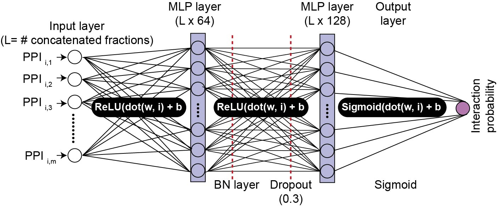
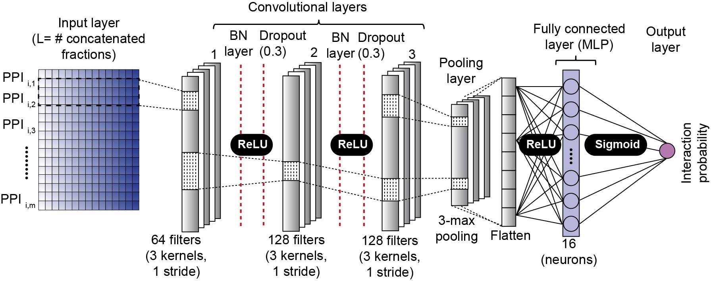
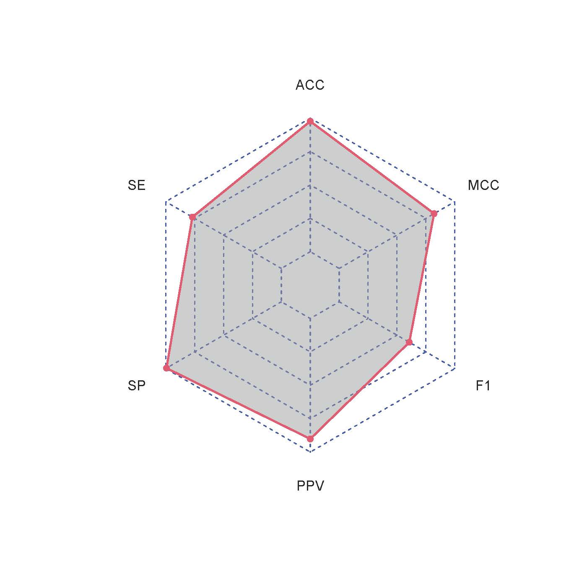
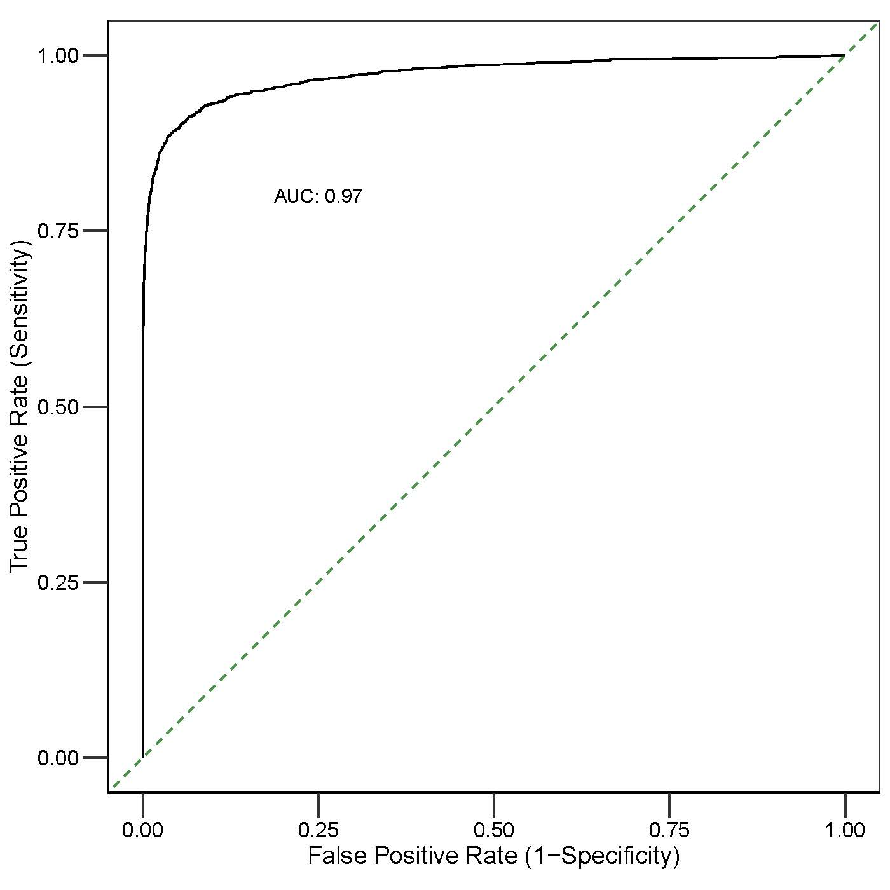
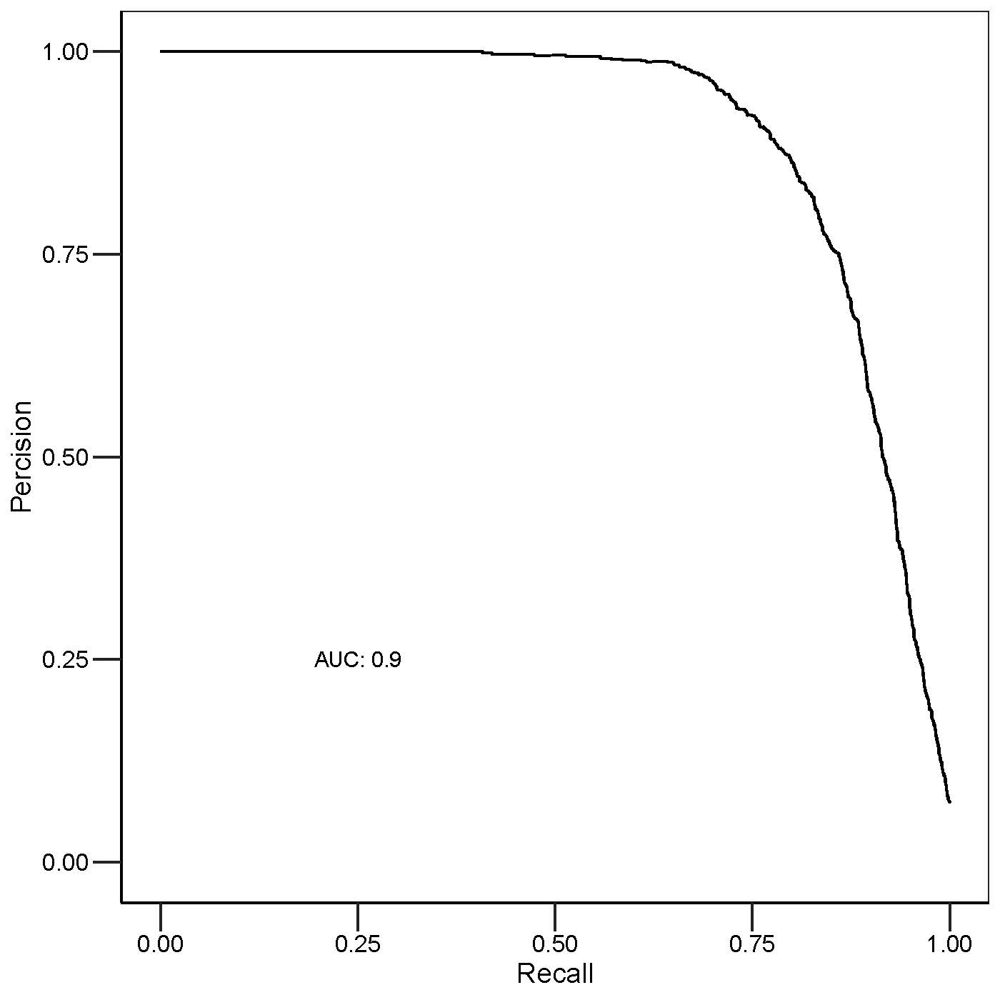

```{r setup, include = FALSE}
knitr::opts_chunk$set(echo = TRUE)
```


# Introduction
Most cellular tasks involve proteins; however, proteins primarily function as 
macromolecular assemblies, playing pivotal roles in regulating almost all 
cellular processes. Therefore, systematic mapping of multi-protein complexes 
formed by protein-protein interactions (PPI) is key to understanding the 
mechanistic basis of cellular processes. Several proteomic methods
have been developed to map protein macromolecular assemblies, such
as yeast two-hybrid (Y2H) screens or affinity purification coupled 
with mass spectrometry (AP-MS). However, such approaches are challenging to 
scale up or apply to non-model organisms. More recently, co-fractionation mass 
spectrometry (CF-MS) is emerging as an alternative strategy for 
proteome-wide characterization of PPIs, which relies on separating protein 
complexes under native conditions utilizing different biochemical techniques
[@havugimana2012census;@pourhaghighi2020brainmap]. 


However, a key 
challenge in the fractionation-based approach is the lack of sensitivity and 
resolution of fractionation that require more advanced computational analysis 
to identify true positive interactions, which can be hard to implement. Despite 
the success of applying classical machine learning frameworks in 
CF-MS analysis [@hu2019epic;@skinnider2021prince], around 85% of novel 
interactions identified by classical machine learning classifiers were 
likely to be false positives, attributed to a high chance of co-elution 
of noninteracting pairs [@shatsky2016quantitative].


Thereby, the primary focus here is to develop a rigorous 
computational strategy to identify genuine interactions from random 
noninteracting protein pairs confidently. For this purpose, we developed a novel 
tool named DeepiCE to predict interactomes from CF/MS data via harnessing 
the power of deep learning (DL) and subsequently 
identifying protein complexes via a sophisticated clustering procedure. Briefly, 
for each fractionation experiment, search output resulting 
from database searching is summarized into a matrix, where rows 
correspond to proteins and absolute or 
relative quantification of proteins (spectral count or summed MS1 ion 
intensity) for a corresponding fraction are represented as columns. Instead of 
computing pair-wise correlation using protein elution profiles as performed 
previously [@hu2019epic;@skinnider2021prince], 
co-elution data are directly concatenated to form a master matrix for input 
into the learner. For classification purposes, the literature-curated 
co-complex PPIs derived from a public database 
(e.g., CORUM, [@ruepp2010corum]) are then mapped onto an experimental 
master matrix, which in turn will be used as an input set for the built-in 
deep-learning algorithm to score potential proteins pairs via cross-validation 
strategy. To enhance the performance of the deep-learning algorithm, 
a parameter sweep strategy is implemented to identify the choice of parameters 
that improve the model performance. The probabilistic interaction network is 
finally partitioned to predict protein complexes via a 
sophisticated clustering procedure that optimizes clustering parameters 
relative to literature-curated protein complexes. 


# DeepiCE computational workflow: step-by-step analysis

Co-elution data analysis using DeepiCE comprises i) data pre-processing,
ii) data preparation for prediction purposes, iii) interactome prediction
via deep learning models, and iv) complex reconstruction from putative 
interactome via unsupervised algorithms. 
In the following, we will explain the main steps of the DeepiCE workflow 
in detail, emphasizing the arguments adjustable by the user.

## Input data requirements
The data files accepted by DeepiCE are simple tables containing relative 
quantification of proteins across collected fractions. The rows correspond to 
identified proteins, each labelled with a unique name, and columns correspond 
to fractions. To demonstrate the use of DeepiCE, we will use a demo co-elution 
data, derived from a subset of the data presented in [@havugimana2012census]. 
In this paper, the authors applied the CF/MS approach to map human protein 
complexes in cytoplasmic extracts, which were resolved 
by different biochemical techniques. An example of CF/MS input data, 
bundled with the DeepiCE package, can be loaded  with the following command:

```{r warning = FALSE, message=FALSE}
# Loading packages required for data handling & visualization
library(ggplot2)
library(tidyr)
library(dplyr)
library(igraph)
library(fgsea)

# Loading keras and tensorflow
library(keras)
library(tensorflow)

# Loading DeepiCE package
library(DeepiCE)
# Loading the demo data
data(HelaCE)
dim(HelaCE)
```

## Pre-processing
Before interactome scoring, DeepiCE applies different data-processing steps, 
including missing value imputation, data-noise reduction, row-wise 
normalization, along with post-processing figures, to enhance the predicted 
interactome quality before classification.

- `impute_MissingData` provides the option to impute zero-values that occur 
at random (MAR) by applying spline fit across the fractionation table. 
We recommend that a zero value is 
considered as ‘missing at random’ in case a quantitative (non-zero) signal 
has been detected in both the two fractions preceding and following 
the fraction in question, controlled by 
arguments `bound_left` and `bound_right`.The effect of imputation on 
raw data can also be visualized by setting the argument `plotImputationSummary`
to TRUE. 

```{r}
dataP <- impute_MissingData(HelaCE,bound_left = 2,bound_right = 2)
```

- `RemoveSinglePeak` provides the option to remove the data noise by 
replacing single-fraction peaks with zero. Users can also see the effect
of this pre-processing on the raw data by setting the `plot_RemovalSinglePeaks` 
to TRUE.

```{r, eval=FALSE}
dataP <- RemoveSinglePeak(dataP)
```

- `filter_ConsecutivePep` allows removal of false-positive peptides that have 
never been detected in more than *N* consecutive fractions, controlled by 
argument `min_stretch_length`.
```{r}
dataP <- filter_ConsecutivePep(dataP,min_stretch_length=2)
```

- `scaling_m` standardize every protein co-elution profile by performing 
row-wise normalization.
```{r}
dataP <- scaling_m(dataP)
```


## Data input for prediction 
To score potential interactions in the processed metric, the DeepiCE package 
takes two inputs: a co-elution data matrix and a literature-curated set of 
protein complexes. Co-elution profiles of protein pairs are then directly 
concatenated by `getPPI` function. 
For instance, if protein A has the vector reading *m* 
(protein elution profile) and protein B has the vector reading *n*, 
the co-elution profiles of two proteins are
concatenated as *m+n* to represent their interaction profiles. To  reduce
noises in the interaction profile, this function removes putative PPIs where 
two proteins that never occurred in at least one fractions [@hu2019epic]. 

```{r}
conc_dat <- getPPI(dataP)
```

To construct class labels for training purposes, the literature curated 
complexes can be downloaded from the CORUM database via the DeepiCE package 
using `getCPX` function, or users can submit their list of reference 
complexes. The `refcpx`, bundled with the DeepiCE package, is extracted from 
CORUM database. Once the reference set is imported, only protein complexes 
containing at least three proteins observed in the raw-co-elution data are 
retained in the reference dataset. Further, to remove redundancy in the 
reference set,`build_trainingData` merge highly overlapping protein 
complexes (i.e., protein complexes 
sharing a high fraction of subunits) with a Jaccard index of at 
least 0.8. The sets of positive and negative PPIs are then  generated from 
pre-processed reference set by `build_trainingData` function for the purpose 
of training and evaluating the DL models. A positive PPI is defined as protein 
pairs that belong to the same complex. The negative PPIs are protein pairs in 
the annotated reference set but never participate within the same protein 
complex.


```{r}
# Load reference set 
data("refcpx")
t_data <- build_trainingData(conc_dat, refcpx)
```

## Interactome scoring via deep learning
The DeepiCE deploys two DL models: the multi-layer perceptron (MLP) and 
one-dimensional convolutional neural networks (1D-CNN) of the Python deep 
learning package [Keras](https://github.com/rstudio/keras) in an R interface to 
predict PPIs. We suggest users to employ MLP architecture for predicting PPIs as
MLP architecture generally provided excellent performance when we 
applied 5-CV and used independent test sets.

The deep learning frameworks provided in the DeepiCE package take 
constructed master matrix `conc_dat` and class labels `t_data` as input objects 
and score every potential protein-protein interaction via a *k*-fold 
cross-validation strategy. During cross-validation, the training data is split 
into a training set (to model) throughout resampling. The trained model is 
subsequently used to score the association in the remaining training set 
as well as test (unknown) interactions.
The DeepiCE package also enables estimation of the 
algorithmic performance of the trained model via cross-validation and the use 
of different performance measures such as Recall (Sensitivity), 
Specificity, Accuracy, Precision, F1-score, and Matthews correlation 
coefficient (MCC). 
The corresponding formulae are as follows: 
  
\[
  Recall=Sensitivity=TPR=\frac{TP}{TP+FN}
\]

\[
  Specificity=1-FPR=\frac{TN}{TN+FP}
\]

\[
  Accuracy=\frac{TP+TN}{TP+TN+FP+FN}
\]

\[
  Precision=\frac{TP}{TP+FP}
\]


\[
  F1=2 \text{ × } \frac{Precision \text{ × } Recall}{Precision + Recall}
\]

\[
  MCC=\frac{TP \text{ × } TN - FP  \text{ × } FN}{\sqrt{(TP+FP)\text{ × } 
  (TP+FN)\text{ × } (TN+FP)\text{ × } (TN+FN)}}
\]

### Default MLP architecture in DeepiCE
MLP architecture in the `MLP_m` function contains six layers, including an input 
layer, two dense layers (i.e., MLP layers), one batch normalization layer, 
one dropout layer and an output layer (Figure 1). 
The sigmoid activation function is
applied to the node in the output layer to output a probability vector 
(a score between 0 and 1, indicating how likely the sample is to have the 
target "1": that is, how likely the PPI is to be positive). The input layer 
includes a vector of length (L) input numbers, equaling the number of 
concatenated co-elution profiles (i.e., fractions) of a given protein pair. 
Each of the 64 nodes in the first hidden layer
is applied to the input layer to generate output to be 
passed to the next layer through the non-linear transformation of its 
inputs with the rectified-linear unit (ReLU) activation function. 
The hidden feature generated by 64 nodes in the first MLP layer is used as 
input to be transformed to the second MLP layer composed of 128 nodes. The 
node in the last hidden layer is fully connected to one node 
in the output layer to predict the probability of protein interactions. 
To correctly penalize model errors on the output 
prediction, the binary cross-entropy loss function is employed with the
RMSprop optimizer to optimize the network. For training purposes, 
the concatenated co-elution profiles are split into multiple mini-batches of 
size 128. All the mini-batches are trained for 50 epochs, and loss 
on the validation set was monitored by early stopping with patience equal to 5.



  <p align="right"> **Figure 1:The default architecture of MLP for PPI prediction from CF/MS data.**


This `MLP_m` function takes the following parameters:

- `data` A matrix containing concatenated co-elution profiles,
generated from `getPPI` function.
- `train_d` A matrix of training data containing numerical features,
generated from `build_trainingData` function.
- `train_l` A vector of binary categorical label (0-1),
generated from `build_trainingData` function.
- `nlayers` Number of hidden layers. Defaults to 2.
- `powerto1` Integer, the number of neurons in the first hidden layer as defined 
by two to the power of this value. Defaults to 6.
- `powerto2` Integer, the number of neurons in the subsequent hidden layer as 
defined by two to the power of this value. Defaults to 7.
- `drate` Numeric, the dropout rate. Defaults to 0.1.
- `optimizer` Name of the optimizer. Defaults to "rmsprop".
- `b_size` Number of samples per gradient update. Defaults to 128.
- `epochs` Number of epochs to train the model. Defaults to 50.
- `cv_fold` Number of partitions for cross-validation; defaults to 5.
- `cutoff` An integer range between [0,1] for specifying the cutoff for 
classifier confidence score to subset the high-confidence interactions.
- `plots` Logical value, indicating whether to plot the performance of the 
learning algorithm using k-fold cross-validation, defaults to FALSE.
- `tpath`  character string indicating the path to the project directory. 
If the directory is missing, performance PDF plot will be stored in 
the Temp directory.


To predict interactions via MLP, the following command can be executed:

```{r  warning = FALSE, message=FALSE,results="hide"}
# set the seed to ensure reproducible output
set_random_seed(2)
MLP_interactions <- 
  MLP_m(conc_dat, #concatenated co-elution profiles
      t_data$train_d, #training data matrix
      t_data$train_l, #training data label
      cv_fold =3,
      cutoff = 0.5)
```

### Default 1D-CNN architecture in DeepiCE
The 1D-CNN model in `oneD_CNN` function contains eight layers, including an 
input layer, three convolutional layers, one batch normalization layer, 
one dropout layer, one fully connected hidden layer (MLP) and an output layer
(Figure 2). 
Each of the 64 filters (1-D kernel with size three and stride one) in the first 
convolution layer is applied to the windows in the input layer to generate a 
feature map through convolution operation and 
non-linear transformation of its input with the ReLU activation function. 
The hidden features generated by the first convolution layer are used as input 
to be transformed to the second and third convolution layer with 
128 filters (1-D kernel with size three and stride one) in the same way. 
The *k*-max pooling layer is then added after the convolutional layers to 
reduce the spatial size of the convoluted feature map, where *k* is set to 3. 
The extracted features learned from CNN and pooling layers are merged into one 
long vector, which is then fed into a dense layer consisting of 16 nodes.
Nodes in the last hidden layer are fully connected to one node in the output 
layer to predict the probability of protein interactions using sigmoid 
activation function. Like MLP, the binary cross-entropy loss function is 
employed to penalize model errors with an RMSprop optimizer to optimize the 
network. For training purposes, the concatenated co-elution profiles are 
split into multiple mini-batches of size 128. All the mini-batches are trained 
for 50 epochs, and loss on the validation set was monitored by 
early stopping with patience equal to 5.


  <p align="right"> **Figure 2:The default architecture of 1D-CNN for PPI prediction from CF/MS data.**


This function takes the following arguments:

- `data` A matrix containing concatenated co-elution profiles,
generated from `getPPI` function.
- `train_d` A matrix of training data containing numerical features,
generated from `build_trainingData` function.
- `train_l` A vector of binary categorical label (0-1),
generated from `build_trainingData` function.
- `nlayers` Number of hidden layers; defaults to 3.
- `filters_1` Integer, the dimensionality of the output space 
(i.e. the number of output filters in the first convolution).Defaults to 64.
- `filters_2` Integer, the dimensionality of the output space 
(i.e. the number of output filters in the subsequent convolution). 
Defaults to 128.
- `kernel_size` An integer or tuple/list of 2 integers, specifying the height 
and width of the 2D convolution window. Can be a single integer to specify 
the same value for all spatial dimensions. Defaults to 3.
- `strides` An integer or tuple/list of 2 integers, specifying the strides 
of the convolution along the height and width. Can be a single integer to 
specify the same value for all spatial dimensions. Defaults to 1.
- `pool_size` Down samples the input representation by taking the maximum 
value over a spatial window of size pool_size. Defaults to 3.
- `powerto` Integer, the number of neurons in the last layer defined by two to 
the power of this value. Defaults to 4.
- `drate` Numeric, the dropout rates. Defaults to 0.1.
- `optimizer` Name of optimizer; Defaults to "rmsprop".
- `b_size` Number of samples per gradient update. Defaults to 64.
- `epochs` Number of epochs to train the model. Defaults to 50.
- `cv_fold` Number of partitions for cross-validation; defaults to 5.
- `cutoff` An integer range between [0,1] for specifying the cutoff for 
classifier confidence score to subset the high-confidence interactions.
- `plots` Logical value, indicating whether to plot the performance of the 
learning algorithm using k-fold cross-validation, defaults to FALSE.
- `tpath`  character string indicating the path to the project directory. 
Defaults to temp().  If the directory is
missing, performance PDF plot will be stored in the Temp directory.


To prediction interactions via 1d-CNN, the following command can be executed:

```{r  warning = FALSE, message=FALSE, eval=FALSE}
# set the seed to ensure reproducible output
set_random_seed(3)
cnn_interactions <- 
  oneD_CNN(conc_dat, #concatenated co-elution profiles
      t_data$train_d, #training data matrix
      t_data$train_l, #training data label
      cv_fold =3,
      cutoff = 0.5)
```

### Neural network model hyper-parameter optimization 

The default values for both MLP and 1D-CNN architecture have been already 
optimized by applying both models to several heterogeneous co-elution data and 
ensures high-performance. But, in case of low-performance on your co-elution 
data, we recommend testing different configurations for hyperparameters, 
like the number of layer, nodes, drop rates etc., for training to achieve the 
best performing model.

The DeepiCE applies grid strategy to optimize the 
hyper-parameter, in which the model is built for each possible
combination of all the provided hyper-parameter values, followed by 
evaluating the model's performance on the validation set and selecting 
the best values that generate the best results.

For MLP model, this can be 
achieved by using `MLP_tuning` function, that takes training data as input 
and considers optimizing the number of layers `nlayers`, 
neurons per layer `powerto1 or powerto2`, the type of optimizer `optimizer`, 
dropout rate `drate`,and batch-size `b_size`.

For 1D-CNN model, this can be 
achieved by using `oneDCNN_tuning` and considers optimizing the number of 
layers `nlayers`, neurons per layer `filters_2 or filters_3`, 
kernel size `kernel_size`, strides `strides`, pool size `pool_size`, 
the number of neurons in the last layer (i.e., MLP layer) `powerto`, the type 
of optimizer `optimizer`, dropout rate `drate`,and batch-size `b_size`. 

These source codes only requires users to specify the search range of 
hyper-parameter values.Once the range is determined, the algorithm tracks and 
compares hyperparameters' effects on the validation set via different
evaluation metrics across runs to find the best performing values the 
maximizes model's performance Following tuning, both functions automatically 
generate reports to observe comparisons between runs.


For example , To run parameter optimization for MLP model,
we can run the following commands:

```{r results="hide", warning = FALSE, fig.show="hide"}
set_random_seed(4)
tuning_result <-
    MLP_tuning(t_data$train_d, 
                t_data$train_l,
                nlayers = 2,
                powerto1 = c(4,5,6),
                powerto2 = c(4,5), 
                b_size = 64, 
                drate = 0.8,
                metrics = "accuracy",
                epochs = 20, k = 0.3)
```

From the above tale, we can identify the minimum validation error for each 
run:

```{r}
f<- 
  tuning_result %>%
  filter(metric == "loss") 

min_val_error <- 
  f %>%
  filter(data == "validation") %>%
  group_by(run) %>% summarise(min_value.error = 
                                round(min(value, na.rm = TRUE), 3))
head(min_val_error)
```
we can also visualize the results per run to see set of parameters that 
achieved the global minimal loss:

```{r results="hide", warning = FALSE}
ggplot(f, aes(epoch, value, color = data)) +
  geom_point(size = 0.1) +
  geom_line() +
  theme_bw() +
  facet_wrap(.~ run)+
  geom_label(data = min_val_error, aes(label=min_value.error), 
             x = Inf, y = -Inf, hjust=1, vjust=0,
             inherit.aes = FALSE)

```

From the above figure, we can select the run 2 that has achieved the 
minimum validation error and result in slight increase in performance. 
Therefore, we can use those sets of parameters to 
construct our final model for interactome prediction.

## Network-based prediction of protein complexes 
In the final step, DeepiCE allows constructing a set of putative complexes from 
the predicted high-confidence protein interaction network 
(i.e., threshold network) (from section `2.4`) via two-stage clustering 
algorithms to identify clusters representing protein complexes. 

First, each threshold network is partitioned via the 
[ClusterOne](https://paccanarolab.org/static_content/clusterone/cl1-procope-1.0.html) 
clustering algorithm. The input data for this function must be 
in `ppi_input_ClusterOne.txt` format. Therefore, we previously saved the 
predicted high-confidence 
network from section `2.4.1` in our system directory. Finally, we can run 
the `get_clusters` function to predict putative complexes via ClusterOne using 
the high-confidence network as input data. 

Then, for each densely connected 
region detected by ClusterOne, users can further apply the 
[MCL](https://cran.r-project.org/web/packages/MCL/MCL.pdf) algorithm
to partition them into smaller clusters using the `MCL_clustering` function
provided in the DeepiCE package. The `MCL_clustering` takes the putative 
threshold network (`2.4`) and predicted complexes from ClusterOne as 
inputs in order to partition the big clusters. 


The `get_clusters` takes the following arguments: 

- `csize`  Numerical value, the minimum size of the predicted complexes.
Defaults to 2.
- `d` A number, specifies the density of predicted complexes. Defaults to 0.3.
- `p` An integer, specifies the penalty value for the inclusion of each node.
Defaults to 2.
- `mx_overlap` A number, specifies the maximum allowed
overlap between two clusters. Defaults to 0.8.
- `tpath` A character string indicating the path to the project
directory that contains the interaction data. Interactions data must be
stored as `ppi_input_ClusterOne.txt` file and 
containing id1-id2-weight triplets.


The following command can be used to predict putative complexes using ClusterOne:
```{r}
pred_cpx <- get_clusters(csize = 2, 
                         d = 0.3, p = 2,mx_overlap = 0.8,
                         tpath =file.path(system.file("extdata", 
                                                      package = "DeepiCE")))
dim(pred_cpx)
```


The `MCL_clustering` takes the following arguments:

- `hc_ppi` Interactions data containing id1-id2-weight triplets predicted 
from deep learning algorithms.
- `predcpx` A data.frame containing predicted modules resulted from ClusterOne
algorithm.
- `inflation` MCL inflation parameter. Defaults to 4.
- `csize`  Numerical value, the minimum size of the predicted complexes.
Defaults to 2.

The following command can be used to predict putative complexes using MCL:
```{r}
pred_cpx_mcl <- 
  MCL_clustering(MLP_interactions,pred_cpx, inflation = 8, csize =2)
dim(pred_cpx_mcl)
```

### Clustering parameter optimization
As with many unsupervised machine learning methods, these algorithms 
include several tunable parameters that require optimization . Indeed, the 
performance of these algorithms is critically sensitive to the selection of 
these parameter values and varies depending on the input data
[@stacey2021robustness;@drew2017integration;@drew2021hu].
Therefore, the effect of such parameters needs to be optimized to 
obtain high-quality protein complexes.

To remedy this, included functionalities 
in the DeepiCE package that select the best parameters for both clustering 
algorithms via grid search optimization. Briefly, for each parameter combination 
setting specified by the users, putative complexes are compared against an 
independent benchmark of known protein complexes (i.e., CORUM) via different 
external evaluation metrics 
(i.e., maximum matching ratio *(MMR)*, accuracy *(Acc)*, and overlap *(O)*)
[@nepusz2012detecting]
and those parameters yielding the highest final composite score 
(sum of *O*, *Acc*, and *MMR*) can then be used to predict complexes. 


The `clusterONE_tuning` function performs the tuning process for ClusterOne 
algorithms and considers the density threshold *d*, penalty *p* and *overlap*
value  between clusters. At the same time, `MCL_tuning` function tunes the
inflation parameter of MCL clustering. To 
avoid evaluation biases, we recommend to first reduce redundancy in the known 
reference complexes via `RemoveCpxRedundance` function. This function 
reduces redundancy in the reference complexes by first computing the overlap 
of two complexes via Jaccard index, followed by merging overlapping complexes
with user-defined threshold. 


To perform ClustOne optimization, we can use the following command: 
```{r}
# first load the reference complex
data("refcpx")
set.seed(103)
Clust_tuning_result <-
  clusterONE_tuning(refcpx, csize = 3, 
                d = c(0.3,0.4),
                p = c(2, 2.5),
                mx_overlap = c(0.6,0.7),
                tpath =
                  file.path(system.file("extdata", package = "DeepiCE")))
```

we can then visualize the results per run to see set of parameters that 
achieved the highest composite score:

```{r} 
ggplot(Clust_tuning_result, aes(tune_names, compScore)) +
  geom_point(size = 3) +
  coord_flip() +
  theme_bw() +
  theme(text = element_text(size=15)) +
  theme(axis.line = element_line(colour = "black"),
        panel.grid.major = element_blank(),
        panel.grid.minor = element_blank()) +
  theme(axis.text = element_text(
    color = "black", # label color and size
    size = 12))  +
  theme(axis.ticks = element_line(
    colour = "black",
    size = 0.75, linetype = "solid"
  )) +
  theme(axis.ticks.length=unit(0.3, "cm"))

```

For instance, we observed run 6 achieved the maximum composite score, then we
use them to predict our final predicted complexes via ClusterOne algortihm:

```{r}
pred_cpx_optimized <- get_clusters(csize = 2, 
                         d = 0.3, p = 2.5,mx_overlap = 0.7,
                         tpath =file.path(system.file("extdata", 
                                                      package = "DeepiCE")))
dim(pred_cpx_optimized)
```

We can then tune the parameters for MLC clustering using the optimized clusters
obtained from ClusterOne as input:

```{r}
mcl_tuning_result <- 
  MCL_tuning(MLP_interactions,
             pred_cpx_optimized, 
             refcpx,
             inflation = c(6,8,9))
```
Finally, the inflation value (9) resulting in highest composite score can be 
used to drive the final set of complexes from the MCL algorithm.


```{r}
finla_clusters <- 
  MCL_clustering(MLP_interactions,
             pred_cpx_optimized, 
             inflation = 9, 
             csize = 2)
dim(finla_clusters)
```

# DeepiCE computational workflow: one-step analysis
The main function of the DeepiCE package are `prePPI_MLP` and `predPPI_1D.CNN`.
Both functions provides an end-to-end workflow for predicting interactomes 
from CF/MS data via deep learning approach and subsequently identifying protein 
complexes via unsupervised approach. 

Briefly, these functions begins by 
executing several pre-processing steps (section `2.2`) to improve 
prediction quality. The processed co-elution profiles of putative interacting 
proteins are concatenated and, with a set of reference complexes (section
`2.3`),are fed into a multi-layer perceptron (MLP) or one-dimensional 
convolutional neural network (1D-CNN) (section `2.4`). 
These models then generate a 
weighted protein interaction network via cross-validation strategy,
in which edge weights between protein nodes represent the deep learning model’s 
probability estimate for interactions. Interactions below the user-defined 
threshold are excluded from further analysis. 

Finally,  high-confidence networks is partitioned to predict protein complexes 
via a two-stage clustering procedure (section `2.5`), clustering first using 
ClusterOne, and then further clustering with MCL.Following prediction, 
three `.txt` files including threshold network, and predicted complexes are 
returned in the user-defined directory. In case of low-performance of 
the prediction algorithms or clustering algorithms, we recommend users to first
use the tuning functions provided in the DeepiCE package
and substitute the default values with the values resulting
in the highest performance.  


## Prediction via Multilayer Perceptron (MLP)

The `prePPI_MLP` function takes the following arguments:


- `data` A data matrix with rows including proteins and fractions
along the columns.
- `refcpx` A list of known reference complexes.
- `data_imputed` If true, detects and imputes missing values. Defaults
to FALSE.
- `remove_SinglePeak` If TRUE, removes Single Peak. Defaults to FALSE.
- `remove_ConsecutivePep` If TRUE, filters peptides by consecutive
peptide detection. Defaults to TRUE.
- `min_stretch_length` Numeric integer, the minimal length a stretch of
continuous identifications has to have in order not to be removed.
Defaults to 2.
- `nlayers` Number of hidden layers. Defaults to 2.
- `powerto1` Integer, the number of neurons in the first hidden layer
as defined by two to the power of this value. Defaults to 6.
- `powerto2` Integer, the number of neurons in the subsequent hidden
layer as defined by two to the power of this value. Defaults to 7.
- `drate` Numeric, the dropout rates. Defaults to 0.1.
- `optimizer` Name of the optimizer.For most models, this defaults 
to "rmsprop"
- `b_size` Number of samples per gradient update. Defaults to 128.
- `epochs` Number of epochs to train the model. Defaults to 50. 
- `cv_fold` Number of partitions for cross-validation; Defaults to 5.
- `cutoff` An integer range between [0,1] for specifying the cutoff for 
classifier confidence score to subset the high-confidence interactions.
- `plots` Logical value, indicating whether to plot the performance of
the learning algorithm using k-fold cross-validation; Defaults to FALSE.
- `csize`  Numerical value, specifying the minimum size of the 
predicted complexes. Defaults to 2.
- `d` A number, specifying the density of predicted complexes; defaults to 0.3.
- `p` An integer, specifying the penalty value for the inclusion of each node;
defaults to 2.
- `mx_overlap` A number, specifying  the maximum allowed
overlap between two clusters; defaults to 0.8.
- `inflation` MCL inflation parameter. Defaults to 4
- `tpath`  character string indicating the path to the project directory.
Defaults to Temp() dir.


Once we have loaded a co-elution matrix and list of gold standard protein 
complexes into R, inferring the interactome and protein complexes with
`prePPI_MLP` using default parameters is therefore as simple as the 
following command:

```{r results="hide", message = FALSE, warning = FALSE}
data("HelaCE")
data("refcpx")
MLP_prediction_outputs <- 
  predPPI_MLP(HelaCE,
              refcpx,
              cv_fold = 5,
              tpath = tempdir())
```

When the `plots` argument set to TRUE, the `prePPI_MLP` function generates 
one pdf file indicating the performance of the model using k-fold cross-
validation. 

- The first plot shows the accuracy (ACC), F1-score ,positive predictive value 
(PPV),sensitivity (SE),and Matthews correlation coefficient (MCC)
of the model via radar plot.

  <p align="right"> **Figure 3: Radar plot.**


- The second plot shows the Receiver Operating Characteristic (ROC) curve.

  <p align="right"> **Figure 4: ROC_Curve curve.**
  
- The third plot shows the Precision-Recall (PR) curve 

  <p align="right"> **Figure 5: Precision-Recall (PR) curve.**


## Prediction via one-dimensional convolution neural network (1D-CNN)
  
The `predPPI_1D.CNN` function takes the following arguments:

- `data` A data matrix with rows including proteins and fractions
along the columns.
-`refcpx` A list of known reference complexes.
-`data_imputed` If true, detects and imputes missing values. Defaults
to FALSE.
- `remove_SinglePeak` If TRUE, removes Single Peak. Defaults to FALSE.
- `remove_ConsecutivePep` If TRUE, filters peptides by consecutive
peptide detection. Defaults to TRUE.
- `min_stretch_length` Numeric integer, the minimal length a stretch of
continuous identifications has to have in order not to be removed.
Defaults to 2. 
- `scaling` If TRUE, performs row-wise normalization. Defaults to TRUE.
- `nlayers` Number of hidden layers. Defaults to 2.
- `filters_1` Integer, the dimensionality of the output space
(i.e. the number of output filters in the first convolution).
Defaults to 64.
- `filters_2` Integer, the dimensionality of the output space
(i.e. the number of output filters in the subsequent convolution).
Defaults to 128.
- `kernel_size` An integer or tuple/list of 2 integers, specifying the
height and width of the 2D convolution window. Can be a single integer to
specify the same value for all spatial dimensions.
Defaults to 3.
- `strides` An integer or tuple/list of 2 integers, specifying the
strides of the convolution along the height and width. Can be a single
integer to specify the same value for all spatial dimensions.
Defaults to 1.
- `pool_size` Downsamples the input representation by taking the
maximum value over a spatial window of size pool_size.
Defaults to 3.
- `powerto` Integer, the number of neurons in the last layer
as defined by two to the power of this value.
Defaults to 4. 
- `drate` Numeric, the dropout rates.
Defaults to 0.1.
- `b_size` Number of samples per gradient update.Defaults to 64.
- `epochs` Number of epochs to train the model.Defaults to 50. 
- `cv_fold` Number of partitions for cross-validation; Defaults to 5.
- `cutoff` An integer range between [0,1] for specifying the cutoff for 
classifier confidence score to subset the high-confidence interactions.
Defaults to 0.5.
- `plots` Logical value, indicating whether to plot the performance of
the learning algorithm using k-fold cross-validation; Defaults to FALSE.
- `csize`  Numerical value, specifying the minimum size of the 
predicted complexes. Defaults to 2.
- `d` A number, specifying the density of predicted complexes; defaults to 0.3.
- `p` An integer, specifying the penalty value for the inclusion of each node;
defaults to 2.
- `mx_overlap` A number, specifying  the maximum allowed
overlap between two clusters; defaults to 0.8.
- `inflation` MCL inflation parameter. Defaults to 4
- `tpath`  character string indicating the path to the project directory.
Defaults to Temp() dir.


Prediction of interactomes and putative complexes via `predPPI_1D.CNN` using
default parameters is therefore as simple as the following command:

```{r  message = FALSE, warning = FALSE, eval=FALSE}
data("HelaCE")
data("refcpx")
oneDCNN_prediction_outputs <- 
  predPPI_1D.CNN(HelaCE,
              refcpx,
              nlayers = 1,
              cv_fold = 3)
```

# Additional features

## Network visualization 
The predicted networks can also be visualized in 
[Cytoskape](http://www.cytoscape.org/download.php) tool 
directly from R by using the 
[RCy3](https://bioconductor.org/packages/RCy3/) R package. 

For example to visualize the high-confidence network from section `3.1`, 
make sure to first launch Cytoscape and the run the following commands: 

```{r, eval=FALSE}
ig <- 
   graph_from_data_frame(MLP_prediction_outputs$ppi_input_ClusterOne)

createNetworkFromIgraph(ig,"myIgraph")
```

## GO and pathway enrichment analysis of protein complexes 
To enable enrichment analysis for three GO domains (molecular function, 
cellular component and biological process), KEGG and REACTOME pathways, 
g:profiler [@kolberg2020gprofiler2] is applied with an FDR 
p‐value correction per each complex via the `enrichfindCPX` function. 

For instance, the following command can be used to performs GO.BP functional 
enrichment analysis of predicted complexes from section `3.1`:

```{r, warning=FALSE, message=FALSE, results='hide', eval = FALSE}
# extract the predicted complexes
predcpx <- MLP_prediction_outputs$predicted_cpx_MCL

enrich_result <- 
  enrichfindCPX(predcpx,
                threshold = 0.05,
                sources = "GO:BP",
                p.corrction.method = "bonferroni",
                org = "hsapiens")
```

## Calculation of differential protein-protein interactions
To identify altered interactions, DeepiCE implements the `comp.2.cc.fdr2`
function in the 
[DiffCorr](https://cran.rstudio.com/web/packages/DiffCorr/index.html)
package, where it first computes Pearson correlation
(PCC) to calculate protein elution profile similarity, followed by computing 
the differences between the two correlations via 
Fisher's z-test. Identified DIPs can then be mapped to 
complexes/Go annotation/pathways provided by the users via 
gene set enrichment analysis (GSEA), using the 
[fgsea](https://bioconductor.org/packages/fgsea/) R package to
determine the biological meaning of DIPs. 

Identification of differential interacting proteins (DIPs) between 
two experimental conditions can be computed using the following command:
```{r,message=FALSE, results='hide', warning=FALSE, fig.show="hide"}
# profile 1
data("m1")
# profile 2
data("m2")
# biological term (here is known complexes)
data("refcpx")
diff_output <- diffPPI(m1, 
                       m2, 
                       term = refcpx,
                       minSize = 2,
                       tpath = tempdir())
```

One can also make an enrichment plot for a pathway:

```{r}
plotEnrichment(diff_output$term_list[["F1F0-ATP synthase, mitochondrial"]],
               diff_output$vec_rank) +
  labs(title="F1F0-ATP synthase, mitochondrial") +
   theme_bw() +
  theme(text = element_text(size=15)) +
  theme_bw() +
  theme(axis.line = element_line(colour = "black"),
        panel.grid.major = element_blank(),
        panel.grid.minor = element_blank()) +
  theme(axis.text = element_text(
    color = "black", # label color and size
    size = 12))  +
  theme(axis.ticks = element_line(
    colour = "black",
    size = 0.75, linetype = "solid"
  )) +
  theme(axis.ticks.length=unit(0.3, "cm"))

```


## Correlation methods 
The DeepiCE package also included up to 13 measures of associations to 
quantify the similarity of each chromatogram pairs in an unsupervised way. 
These measures of associations included in the package are 
Pearson correlation, Spearman correlation, Kendall rank correlation, 
biweight midcorrelation, Cosine similarity, Jaccard index, Euclidean distance, 
Manhattan distance, Weighted rank correlation, Mutual information, 
Bayesian correlation, Weighted cross-correlation, and 
Pearson correlation plus noise. One can also combine the similarity scores with 
classifier prediction output to reduce noises in the predicted PPI network. 
For instance, following prediction, [@havugimana2012census] only kept 
protein pairs with a correlation score of at least 0.5 to reduce the total 
number of predicted interactions. 

To compute similarity between two proteins we can run the 
following command: 
```{r, eval=FALSE}
scored_Data <- similarity_score(HelaCE, metric = "pearson")
```

# Session info

```{r}
sessionInfo()
```
# References
